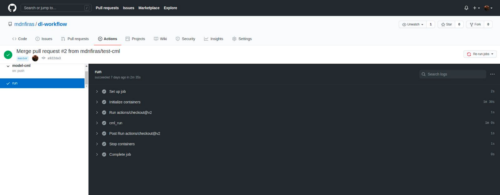

# Supervised Learning for Python3 code translation to C++

This project is still under development.

## Project planning:

### Studying existing deep-learning based code translation project especially for Python and C++

The most successful deep-learning based project was Facebook AI:

https://ai.facebook.com/blog/deep-learning-to-translate-between-programming-languages/

During this phase, we will be gathering information and acknowledging the challenges faced by the Facebook AI team such as why they opted for unsupervised learning.

### Data collection:

During this phase, we will be collecting data for our supervised learning approach. There is no available Dataset that meets the requirements of our project, so we decided to collect our data from Codeforces platform.

Codeforces is an online competitive programming website where users can start and participate in coding contests that require them to solve algorithmic problems using any chosen programming language.

Thanks to Codeforces API, we were already able to collect about 3500correct submissions in Python 3 and 15000 correct submissions in C++.

### Data preprocessing:
During this phase, we will be cleaning and preprocessing our data. Code formatting is one of the required steps. This phase will be the focus of our project as it will be the “decisive key”.

### Implementing and optimising the model:
During this iterative phase, we will be comparing different model implementations and hyperparameters while aiming to optimize the model’s accuracy. We will be favouring accuracy over speed.

### Workflow:
We have set up the workflow environment that we will be using during this project. We will be applying MLOps principles (inspired by DevOps principles) to control and test our code in an iterative fashion.

We will be using Github for version control and Github Actions for the continuous integration and automatic testing of each experiment.

Sample CI pipeline using Github Actions:

